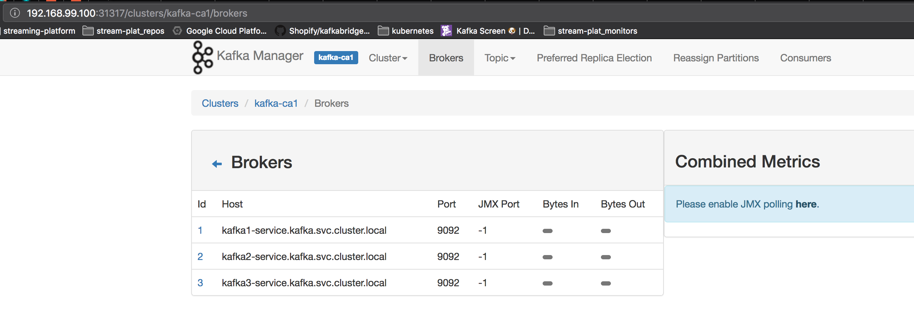

# kafka-cluster with minikube

<!-- markdown-toc start - Don't edit this section. Run M-x markdown-toc-refresh-toc -->
**Table of Contents**

- [kafka-cluster with minikube](#kafka-cluster-with-minikube)
    - [Minikube configuration](#minikube-configuration)
    - [Instructions to build the cluster](#instructions-to-build-the-cluster)
        - [Configure kafka-manager](#configure-kafka-manager)
    - [Monitor cluster resources](#monitor-cluster-resources)
    - [Logs](#logs)
    - [kafka-monitoring](#kafka-monitoring)
        - [Monitor end-to-end a single cluster + JMX](#monitor-end-to-end-a-single-cluster--jmx)
        - [Monitor end-to-end multi-cluster + JMX](#monitor-end-to-end-multi-cluster--jmx)
    - [Connect to JMX metrics](#connect-to-jmx-metrics)
    - [Screenshots](#screenshots)
        - [Cluster view](#cluster-view)
        - [Kafka manager view](#kafka-manager-view)
- [Changelog](#changelog)

<!-- markdown-toc end -->

## Minikube configuration
Suggested minikube start configuration:
```
minikube start --memory=6144 --cpus=4
```

## Instructions to build the cluster

Run the commands in the following order:

``` bash
kubectl apply -f 00-namespace/
kubectl apply -f 01-zookeeper/
kubectl apply -f 02-kafka/
kubectl apply -f 03-yahoo-kafka-manager/
kubectl apply -f 04-kafka-monitor/

# depends on creating a new cluster: kafka-ca2
# replace in all previous files s/kafka-ca1/kafka-ca2 and run steps: 00, 01, and 02.
kubectl apply -f 05-kafka-mirrormaker/
```

### Configure kafka-manager

Open kafka-manager:

``` bash
open $(minikube service -n kafka-ca1 kafka-manager --url)
```

Add new cluster, and use the following data for `Cluster Zookeeper Hosts`:

```
zookeeper-service:2181
```

## Monitor cluster resources

``` bash
watch -n 1 kubectl -n kafka-ca1 get deployments
watch -n 1 kubectl -n kafka-ca1 get statefulsets
watch -n 1 kubectl -n kafka-ca1 get services
watch -n 1 kubectl -n kafka-ca1 get pods
watch -n 1 minikube service list --namespace kafka-ca1
```

## Logs
```bash
kubectl -n kafka-ca1 exec kafka-0 -- tail -f /opt/kafka/logs/state-change.log
kubectl -n kafka-ca1 exec kafka-0 -- tail -f /opt/kafka/logs/server.log
kubectl -n kafka-ca1 exec kafka-0 -- tail -f /opt/kafka/logs/controller.log
```

## kafka-monitoring

Uses kafka-monitor 1.1.x:
https://hub.docker.com/r/d1egoaz/docker-kafka-monitor/

Connect to your local running image to run the test commands:
```bash
kubectl -n kafka-ca1 exec kafka-monitor-{hash} -i -t bash
cd kafka-monitor-1.1.0
```

### Monitor end-to-end a single cluster + JMX

Run the following:
```bash
KAFKA_JMX_OPTS="-Dcom.sun.management.jmxremote -Dcom.sun.management.jmxremote.authenticate=false -Dcom.sun.management.jmxremote.ssl=false -Dcom.sun.management.jmxremote.local.only=false -Dcom.sun.management.jmxremote.port=9999 -Dcom.sun.management.jmxremote.rmi.port=9999 -Djava.rmi.server.hostname=127.0.0.1 " \
  exec ./bin/end-to-end-test.sh --broker-list kafka-0.kafka.kafka-ca1.svc.cluster.local:9092,kafka-1.kafka.kafka-ca1.svc.cluster.local:9092,kafka-2.kafka.kafka-ca1.svc.cluster.local:9092 --zookeeper zookeeper-service.kafka-ca1.svc.cluster.local:2181 \
  --topic testtopic
```

### Monitor a single cluster + JMX using more detailed configuration kafka-monitor.properties

```bash
KAFKA_JMX_OPTS="-Dcom.sun.management.jmxremote -Dcom.sun.management.jmxremote.authenticate=false -Dcom.sun.management.jmxremote.ssl=false -Dcom.sun.management.jmxremote.local.only=false -Dcom.sun.management.jmxremote.port=9999 -Dcom.sun.management.jmxremote.rmi.port=9999 -Djava.rmi.server.hostname=127.0.0.1 " \
  exec ./bin/kafka-monitor-start.sh config/kafka-monitor.properties
```


### Monitor end-to-end multi-cluster + JMX

Run the following command:
```bash
KAFKA_JMX_OPTS="-Dcom.sun.management.jmxremote -Dcom.sun.management.jmxremote.authenticate=false -Dcom.sun.management.jmxremote.ssl=false -Dcom.sun.management.jmxremote.local.only=false -Dcom.sun.management.jmxremote.port=9999 -Dcom.sun.management.jmxremote.rmi.port=9999 -Djava.rmi.server.hostname=127.0.0.1 " \
  exec ./bin/kafka-monitor-start.sh config/multi-cluster-monitor.properties
```

## Connect to JMX metrics

Forward the port:
```bash
kubectl -n kafka-ca1 port-forward kafka-monitor-{hash} 9999
```

Connect using jconsole/jvisualvm:
```bash
jconsole localhost:9999
```

## Screenshots

### Cluster view


### Kafka manager view




# Changelog

- 2018-09-28, Added monitor configuration using config maps
- 2018-09-25, Added kafka-monitor recent image for kafka-monitor 1.1.x
- 2018-09-24, Big refactor, changed per broker config to a single StatefulSet
  - Changed zookeeper image to use the one provided by dockerhub
